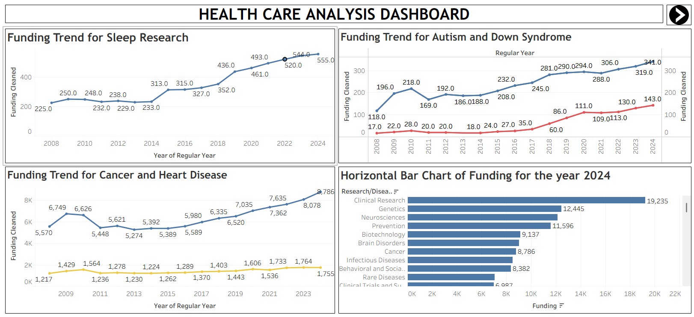

# 🏥 Healthcare Research Funding Analysis Dashboard

An interactive Tableau dashboard that analyzes U.S. healthcare research funding trends using the RCDC (Research, Condition, and Disease Categorization) dataset. The project explores funding distribution across disease areas, research categories, geographic regions, and time while applying advanced Tableau visualizations and trend analysis to support data-driven healthcare investment decisions.

---

# 📌 Project Overview

This project analyzes healthcare research funding in the United States using Tableau. The dashboard examines how funding has evolved from **2008 to 2024**, compares investments across research areas, evaluates geographic funding distribution, and investigates the relationship between funding and disease mortality.

The project combines data preparation, calculated fields, advanced visualizations, and trend modeling to uncover funding patterns and identify opportunities for more balanced healthcare investment.

---

## 📷 Dashboard Preview

---

# 🎯 Project Objectives

- Analyze healthcare research funding trends over time.
- Compare funding across diseases and research categories.
- Identify high- and low-funded research areas.
- Visualize geographic funding distribution across U.S. states.
- Study the relationship between funding and mortality rates.
- Apply trend models to forecast funding patterns.
- Develop an interactive Tableau dashboard for healthcare funding analysis.

---

# 📂 Dataset Information

The project uses the **RCDC (Research, Condition, and Disease Categorization)** Healthcare Funding Dataset.

The dataset contains information such as:

- Research/Disease Area
- Funding Amount
- Funding Type
- Funding Year (2008–2024)
- Mortality Rate
- Disease Prevalence
- Research Categories
- U.S. State

---

# 🛠️ Tools & Technologies Used

- Tableau
- Tableau Prep Techniques
- Calculated Fields
- Table Calculations
- Trend Models
- Geographic Mapping

---

# ⚙️ Data Preparation

The dataset was cleaned and transformed before visualization.

### Data Cleaning

- Removed empty and irrelevant records.
- Replaced missing values and special symbols.
- Corrected invalid funding and mortality values.
- Standardized column names.

### Data Transformation

- Pivoted yearly funding columns (2008–2024).
- Created Funding Type classifications.
- Joined research category information.
- Created calculated fields including:
  - Running Total
  - Yearly Growth %
  - Funding Difference
- Added geographic information for mapping.

---

# 📊 Tableau Features Demonstrated

### Dashboard Components

- Interactive Dashboards
- Dashboard Navigation
- Dashboard Actions
- Filters
- Highlight Actions

### Charts & Visualizations

- Line Charts
- Dual Line Charts
- Horizontal Bar Charts
- Stacked Bar Charts
- Pie Charts
- Donut Charts
- Tree Maps
- Heat Maps
- Scatter Plots
- Box Plots (Whisker Charts)
- Funnel Charts
- Waterfall Charts
- Gantt Charts
- Symbol Maps
- Filled Maps

### Trend Analysis

- Linear Trend Line
- Exponential Trend Line
- Polynomial Trend Line
- Logarithmic Trend Line

### Table Calculations

- Running Sum
- Window Sum
- Year-over-Year Growth

---

# 📈 Dashboard Features

The dashboard provides insights into:

### Funding Analysis

- Funding Trends by Year
- Funding by Research Area
- Funding by Disease
- Funding Type Comparison
- Running Total Funding

### Geographic Analysis

- Funding by U.S. State
- Filled Maps
- Symbol Maps

### Research Category Analysis

- Funding Distribution
- Tree Map
- Heat Map
- Gantt Chart

### Disease Analysis

- Cancer Funding Trends
- Autism & Down Syndrome Funding
- Pregnancy & Infertility Funding
- HIV & Vaccine Research

### Statistical Analysis

- Funding vs Mortality Scatter Plot
- Funding Variability using Box Plot
- Trend Model Comparison

---

# 💡 Key Insights

The analysis revealed several important findings:

- Healthcare research funding showed a steady upward trend from **2008 to 2024**.
- Cancer research consistently received the highest funding, increasing from approximately **5K** to over **8K** during the study period.
- Clinical Research, Genetics, and Neurosciences received the largest funding allocations.
- Research areas such as Sleep Disorders, Down Syndrome, and Infertility received comparatively lower funding.
- Maryland, Washington, and New Jersey received the highest research funding, while several states received significantly lower allocations.
- Scatter plot analysis suggested a weak negative relationship between funding and mortality, indicating that sustained investment may contribute to improved health outcomes.
- Trend models showed continued long-term growth in healthcare research funding, particularly for cancer-related research.

---

# 🚀 Skills Demonstrated

- Tableau
- Data Cleaning
- Data Transformation
- Data Visualization
- Dashboard Design
- Geographic Analysis
- Trend Analysis
- Statistical Visualization
- Healthcare Analytics
- Research Funding Analysis
- Interactive Dashboard Development
- Business Intelligence

---

# 📚 Learning Outcomes

Through this project, I strengthened my understanding of:

- Building interactive dashboards in Tableau.
- Preparing and transforming data for visualization.
- Designing advanced visualizations using multiple chart types.
- Applying trend models to analyze long-term patterns.
- Using geographic maps and statistical charts to communicate insights.
- Transforming healthcare funding data into meaningful, data-driven recommendations.

---

## 👩‍💻 Author

**Tina Thomas**

